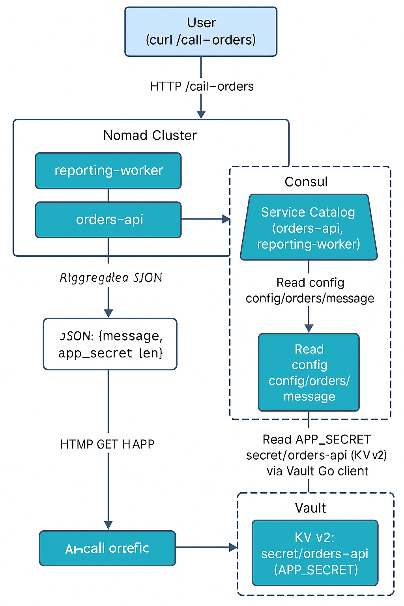

# Sample project using Hashi Stack

This project is a minimal “project” built on **Nomad**, **Consul**, and **Vault** with two containerized services that talk to each other:

- **orders-api**
  - HTTP API that:
    - Exposes `/health` and `/config`
    - Reads a secret `APP_SECRET` from **Vault** (injected by Nomad + Vault template)
    - Reads a config message from **Consul KV** at `config/orders/message`
- **reporting-worker**
  - HTTP API that:
    - Exposes `/health` and `/call-orders`
    - Uses **Consul service discovery** to locate `orders-api`
    - Calls `orders-api`’s `/config` endpoint and returns the response

This demonstrates key HashiStack use cases:
- **Nomad**: job scheduling, Docker driver, service registration, Vault integration via `vault` + `template` stanzas
- **Consul**: service discovery, health checks, KV config
- **Vault**: central secret storage + fine-grained policy, Nomad integration (apps do not talk to Vault directly)

---
# Diagram
                             ┌──────────────────────────┐
                             │        User (curl)       │
                             │   GET /call-orders       │
                             └─────────────┬────────────┘
                                           │
                                           ▼
                      ┌─────────────────────────────────────────┐
                      │        reporting-worker (Nomad)         │
                      │-----------------------------------------│
                      │ • Discovers orders-api via Consul       │
                      │ • Calls http://host.docker.internal:PORT│
                      │   /config                               │
                      └─────────────┬───────────────────────────┘
                                    │ discover + call
                                    │
           ┌────────────────────────────────────────────────────────────────┐
           │                            Consul                              │
           │----------------------------------------------------------------│
           │  Service Catalog: orders-api, reporting-worker                 │
           │  KV: config/orders/message                                     │
           └───────────┬────────────────────────────────────────────────────┘
                       │ healthy instance: host.docker.internal:20088
                       ▼
              ┌─────────────────────────────────┐
              │       orders-api (Nomad)        │
              │---------------------------------│
              │ • Reads Consul KV (message)     │
              │ • Reads Vault KV (APP_SECRET)   │
              │ • /config returns JSON          │
              └──────────┬──────────────────────┘
                         │
       ┌─────────────────┼────────────────────────────────────┐
       │                 │                                    │
       ▼                 ▼                                    ▼
┌────────────────┐  ┌───────────────────┐           ┌──────────────────────┐
│ Consul KV      │  │ Vault KV v2       │           │   Final JSON returned│
│ config/orders/*│  │ secret/orders-api │           │ to reporting-worker  │
└────────────────┘  └───────────────────┘           └──────────────────────┘


---



# Prerequisites

You’ll need the following installed locally:

- Docker (for building/running service images)
- Go 1.22+ (for local builds; optional if you only run Docker builds)
- Nomad (server + client in the same binary)
- Consul
- Vault

Check them:

```bash
nomad version
consul version
vault version
docker version
```

# End to End Testing Flow

## 1. Start Consul in Dev Mode
In one terminal:
```
consul agent -dev -node=dev-consul -bind=127.0.0.1
```
This:
- Starts a single-node Consul server
- Listens on `127.0.0.1:8500`
- Enables a dev keyring and in-memory storage
You can open the Consul UI:
- URL: `http://127.0.0.1:8500/ui`

## 2. Start Vault in Dev Mode
In another terminal:
```
vault server -dev -dev-root-token-id=root
```
Notes:
- Vault listens on `http://127.0.0.1:8200`
- Dev mode auto-unseals and uses in-memory storage
- The root token is root (hard-coded with -dev-root-token-id).

Set environment variables in that terminal:

```
export VAULT_ADDR="http://127.0.0.1:8200"
export VAULT_TOKEN="root"
```
Confirm:
```
vault status
```

# 3. See Vault Secrets and Policy

## 1. Write the Secret for orders-api
We’re using KV v2 at secret/:
```
vault kv put secret/orders-api APP_SECRET="super-secret-value"
```

## 2. Create the app Policy
Policy file (expected at vault/policies/app.hcl):
```
path "secret/data/orders-api" {
  capabilities = ["read"]
}
```
Load the policy into Vault:
```
vault policy write app vault/policies/app.hcl
```

This defines what Nomad jobs using the app policy can do (read only that path).

# 4. Nomad Dev Configuration (with Consul + Vault)
Create a Nomad dev configuration file at nomad/dev.hcl:
```
datacenter = "dc1"
name       = "dev-nomad"
bind_addr  = "0.0.0.0"

server {
  enabled          = true
  bootstrap_expect = 1
}

client {
  enabled = true
}

consul {
  address        = "127.0.0.1:8500"
  client_auto_join = false
  server_auto_join = false
}

vault {
  enabled = true
  address = "http://127.0.0.1:8200"
  token   = "root"
}
```
!Note This tells Nomad to integrate with Consul for service registration and with Vault for secrets.

# 5. Start Nomad Dev Agent
In a third terminal:
```
nomad agent -dev -config=nomad/dev.hcl
```
This starts:
- A single Nomad server + client
- Dev mode (ephemeral state)
- Connected to Consul and Vault
You can visit:
- Nomad UI: `http://127.0.0.1:4646`

# 6. Build the Service Images
From the project root:
## 1. Build orders-api
```
cd services/orders-api

# Optional: tidy and download
go mod tidy

# Build Docker image
docker build -t orders-api:dev .
```

## 2. Build reporting-worker
```
cd ../reporting-worker

go mod tidy
docker build -t reporting-worker:dev .
```
Verify images:
```
docker images | grep -E "orders-api|reporting-worker"
```

# 7. Configure Consul KV for App Config
Set a sample message that orders-api will read from Consul KV:
```
consul kv put config/orders/message "Welcome from Consul KV in dev!"
```
You can check via:
```
consul kv get config/orders/message
```

# 8. Nomad Jobs (Orders + Reporting)
## 1. orders-api Nomad Job
nomad/orders-api.nomad should look similar to:
```
job "orders-api" {
  datacenters = ["dc1"]
  type        = "service"

  group "orders" {
    count = 1

    network {
      port "http" {
        to     = 8080
        static = 18080  # Makes it easy to curl from host
      }
    }

    service {
      name = "orders-api"
      port = "http"

      check {
        name     = "http health"
        type     = "http"
        path     = "/health"
        interval = "5s"
        timeout  = "2s"
      }
    }

    vault {
      policies = ["app"]
    }

    task "orders-api" {
      driver = "docker"

      config {
        image = "orders-api:dev"
        ports = ["http"]
      }

      env {
        PORT = "8080"
      }

      template {
        destination = "secrets/env"
        env         = true

        data = <<EOH
APP_SECRET="{{ with secret "secret/data/orders-api" }}{{ .Data.data.APP_SECRET }}{{ end }}"
EOH
      }

      resources {
        cpu    = 200
        memory = 128
      }
    }
  }
}
```
Key points:

- Uses Docker driver with image = "orders-api:dev"
- Registers a Consul service orders-api with an HTTP health check
- Uses Vault integration (vault { policies = ["app"] }) and a template stanza to inject APP_SECRET as env


## 2. reporting-worker Nomad Job
nomad/reporting-worker.nomad:
```
job "reporting-worker" {
  datacenters = ["dc1"]
  type        = "service"

  group "reporting" {
    count = 1

    network {
      port "http" {
        to     = 8081
        static = 18081  # Makes it easy to curl from host
      }
    }

    service {
      name = "reporting-worker"
      port = "http"

      check {
        name     = "http health"
        type     = "http"
        path     = "/health"
        interval = "5s"
        timeout  = "2s"
      }
    }

    task "reporting-worker" {
      driver = "docker"

      config {
        image = "reporting-worker:dev"
        ports = ["http"]
      }

      env {
        PORT = "8081"
        # Optionally: CONSUL_HTTP_ADDR can be set explicitly if needed
        # CONSUL_HTTP_ADDR = "http://127.0.0.1:8500"
      }

      resources {
        cpu    = 200
        memory = 128
      }
    }
  }
}
```
!Note reporting-worker doesn’t need Vault in this basic example, but we could add it similarly if needed.

# 9. Run the Jobs on Nomad
From the project root:
```
nomad job run nomad/orders-api.nomad
nomad job run nomad/reporting-worker.nomad
```
Check status:
```
nomad status
nomad status orders-api
nomad status reporting-worker
```
You should see allocations “running”.
In Consul:
```
consul catalog services
```
You should see orders-api and reporting-worker.

# 10. Verify Everything End-to-End
## 1. Check orders-api Directly
From host:
```
curl http://127.0.0.1:18080/health
# -> ok

curl http://127.0.0.1:18080/config
```
You should get JSON like:
```
{
  "message": "Welcome from Consul KV in dev!",
  "app_secret": "len=18"
}
```
!Note message comes from Consul KV; app_secret is the length of the secret read from Vault.

## 2. Check reporting-worker and Service Discovery
From host:
```
curl http://127.0.0.1:18081/health
# -> ok

curl http://127.0.0.1:18081/call-orders
```
You should see a JSON payload similar to:
```
{
  "orders_api_url": "http://<container-ip>:8080/config",
  "response": {
    "message": "Welcome from Consul KV in dev!",
    "app_secret": "len=18"
  }
}
```
This confirms:
- reporting-worker discovered orders-api via Consul Health API
- orders-api is reading from Consul KV and Vault
- Nomad is handling the service lifecycle and health checks

# 11. What This Demo Exercises (By Component)
*Nomad*
- *Scheduling*: Two Docker-based services deployed as Nomad service jobs
- *Networking*: Job-level network stanza with service ports
- *Health Checks*: HTTP checks that feed into Consul

*Vault Integration*:
- vault {} block at group level to request Vault tokens
- template stanza to render Vault secrets into environment variables

*Consul*
**Service Discovery**:
- orders-api and reporting-worker registered as Consul services via Nomad service {} stanzas
- reporting-worker calls Consul’s health API to discover orders-api
**Health Catalog**:
- Nomad’s health checks are visible in the Consul catalog and UI
**KV Store**:
- config/orders/message used as configuration for orders-api
*Vault*
**Secrets Management**:
- secret/orders-api path storing application secret APP_SECRET
- KV v2 used with vault kv put secret/orders-api ...
**Policy / RBAC**:
- app policy restricts jobs to reading just secret/data/orders-api
**Nomad Integration**:
- Nomad uses Vault token + policy to render APP_SECRET into orders-api environment without the app ever calling Vault directly


# 12. Cleanup
To stop everything:
Ctrl+C in the terminals running:

- nomad agent ...
- consul agent ...
- vault server ...
Optionally, remove containers:
```
docker ps -a | grep -E "orders-api|reporting-worker" | awk '{print $1}' | xargs docker rm -f
```
And images:
```
docker rmi orders-api:dev reporting-worker:dev
```

